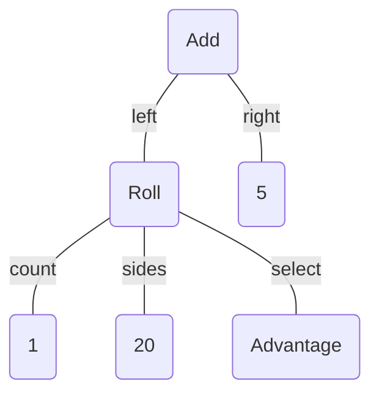

Dice Roller
===========

This is a simple Rust program to parse and evaluate dice expressions using typical notation such as `3d8 + 2`. The normal arithmetic  operations `+`, `-`, `*`, and `/` are supported with `×` and `÷` recognized as alternate forms of `*` and `/`. Products precede sums unless grouped be parentheses. Dice rolls are expressed as &lt;*number of dice*&gt;`d`&lt;*number of sides*&gt; where &lt;*number of sides*&gt; is 4, 6, 8, 10, 12, 20, or 100 (the sequence `d%` is interpreted as `d100`). If the die count is omitted (e.g. `d20 + 5`), it is assumed to be 1 and if the number of sides are omitted (e.g. `4d + 1`), then the dice are assumed to be six-sided. A roll may be followed by any number of selection modifiers, too keep or discard certain dice:

- `k<n>` or `kh<n>`: keep the highest `<n>` dice. If `<n>` is omitted, it is assumed to be 1.
- `kl<n>`: keep the lowest `<n>` dice. If `<n>` is omitted, it is assumed to be 1.
- `d<n>` or `dl<n>`: discard the lowest `<n>` dice. If `<n>` is omitted, it is assumed to be 1.
- `dh<n>`: discard the highest `<n>` dice. If `<n>` is omitted, it is assumed to be 1.
- `adv` or `ad`: reroll the preceding expression and take the higher result.
- `dis` or `da`: reroll the preceding expression and take the lower result.

For example, to roll 4d6 and keep the highest 3 (common in D&D character generation), you could write `4d6kh3` or equivalently `4d6d1` (roll 4d6 and discard the lowest 1). Though uncommon, it is possible to chain several selections and they will be evaluated in order from left to right. `adv` and `dis` refer to "advantage" and "disadvantage" respectively, common in D&D 5e and they have the effect of rerolling the entire previous sub-expression (including any previous selections) and taking the higher or lower total respectively.

Only integers are supported, and the result of an expression is always an integer. When division is performed, the result is rounded down to the nearest integer before the next operation is performed.

Usage
-----

The program reads a single expression from the command line and prints both the total result and the individual dice rolls.

```text
roll [min|mid|max|dot|mermaid] <expr>
```

Where `<expr>` matches the grammar below. If `min`, `mid`, or `max` are specified, then instead of using random numbers, the minimum, middle, or maximum value for each die roll is used. For example:

```text
>roll 3d6 + 2
3d6 + 2
[d6:5] [d6:2] [d6:1] 
total = 10

>roll min 3d6 + 2
3d6 + 2
[d6: 1] [d6: 1] [d6: 1]
total = 5

>roll max 3d6 + 2
3d6 + 2
[d6: 6] [d6: 6] [d6: 6]
total = 20
```

If `dot` is specified, then the expression's syntax tree is printed in [Graphviz DOT](https://graphviz.org/) format. This output can be piped directly to `dot`, for example:

```text
>roll dot "d20adv + 5" | dot -o"ast.svg" -Tsvg
```

Similarly, if `mermaid` is specified, then the expression's syntax tree is printed in [Mermaid](https://mermaid.js.org/) format. For example:

```text
>roll mermaid d20adv + 5
```

Outputs the following:



Grammar
-------

Dice expressions are parsed according to the following grammar:

```ebnf
root = sum;
sum = term, { ("+" | "-"), term };
term = factor, { ("*" | "/"), factor };
factor = "(", sum, ")" | negation | integer | roll;
negation = "-", factor;
roll = [integer], "d", [integer], [selection];
selection = (
        "k", integer |
        "kh", integer |
        "kl", integer |
        "d", integer |
        "dh", integer |
        "dl", integer |
        "adv" | "ad" |
        "dis" | "da"
    ), [selection];
integer = /[0-9]+/;
```
